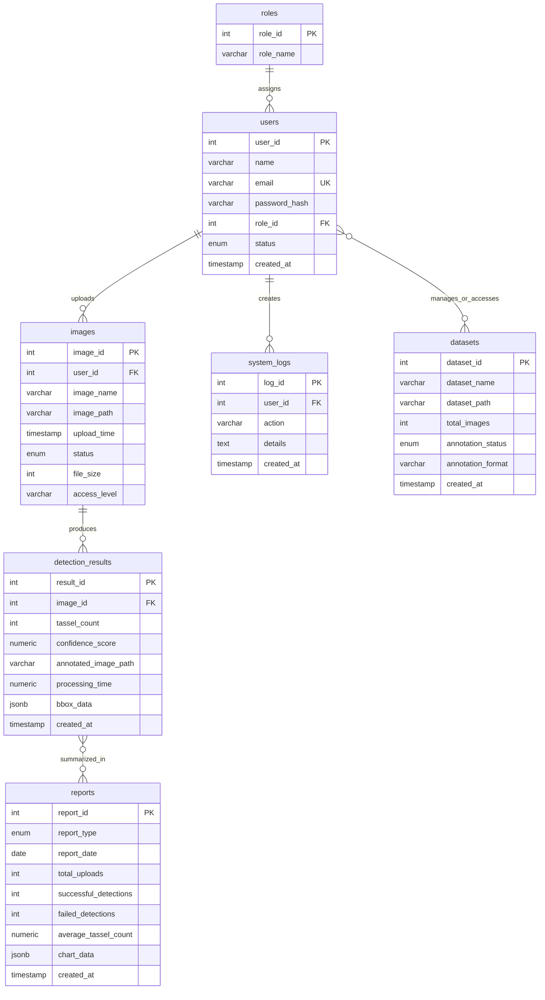

# Maize Detector -- Week 10 Entity Relationship Diagram (ERD)

This ERD follows the revised Week 10 checklist's seven main database tables:
`users`, `roles`, `images`, `detection_results`, `reports`, `system_logs`, and `datasets`.

Notes:
- `users.status`: active / disabled
- `images.status`: pending / processing / completed / failed
- `reports.report_type`: daily / weekly / monthly
- `datasets.annotation_status`: not_started / in_progress / completed
- The `reports` and `datasets` links show project-level business relationships. The Week 10 SQL schema keeps these tables independent without explicit foreign keys.
