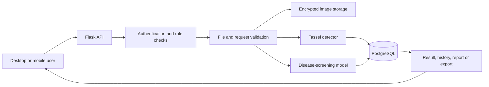

# System Architecture

## Overview

The application uses a browser-based boundary layer, a Flask control layer,
independent AI inference modules, encrypted file storage, and PostgreSQL
persistence. Desktop and mobile pages use the same authenticated API, which
keeps authorization and business rules on the server.

## Components

| Component | Responsibility |
|---|---|
| `frontend/` | Desktop pages, mobile PWA, upload progress and result presentation |
| `backend/app.py` | Routes, authentication, role authorization, validation and persistence orchestration |
| `backend/inference.py` | YOLO tassel detection, optional tiling and response normalization |
| `backend/disease_inference.py` | Image-quality checks, calibrated disease inference and uncertainty rejection |
| `backend/advice_engine.py` | Human-centred Agronomist guidance and language normalization |
| PostgreSQL | Users, fields, images, results, model registry, reviews and audit data |
| Encrypted storage | Uploaded image bytes and generated image artefacts |
| `models/deployment/` | Versioned runtime model files managed by Git LFS |

## Request flow

## Trust boundaries

- The browser never receives database credentials or encryption keys.
- Access tokens identify the current user and role.
- Uploaded files are type-checked and decoded before inference.
- Database statements use parameters rather than string-built SQL.
- Image content is encrypted before persistent storage.
- Model activation requires a real model file rather than a Git LFS pointer.
- Disease metadata must pass deployment gates before the model is accepted.

## Deployment model

The local assessment configuration serves frontend and API content from one
Flask origin. This avoids cross-origin and mobile-session inconsistencies. A
public deployment should terminate HTTPS at a managed platform or reverse proxy
and inject secrets through its environment configuration.
