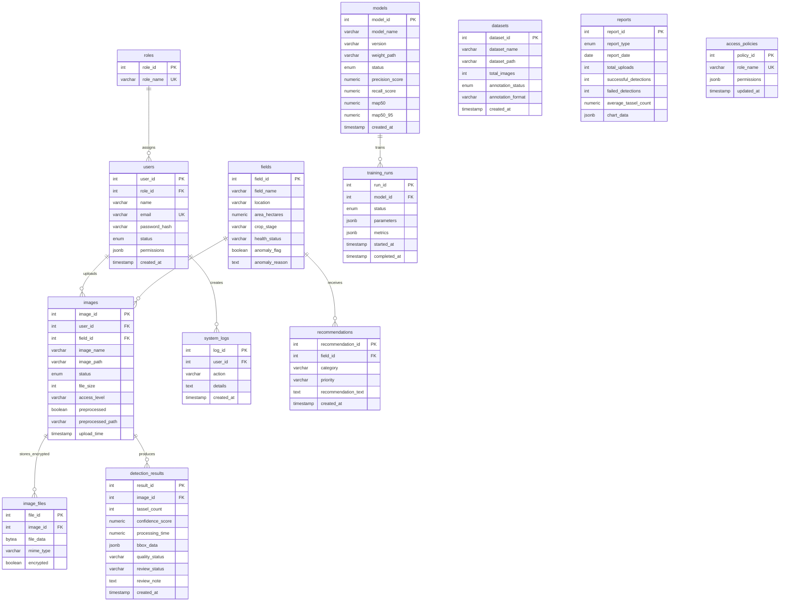

# Maize Detector Entity Relationship Diagram

This ERD reflects the implemented PostgreSQL schema and the BCE entities used by
the Farmer, Researcher, Agronomist, Admin, and AI System stories.

`database/migrations/001_user_story_compliance.sql` upgrades an existing installation
without deleting its data. `database/schema/schema_postgresql.sql` creates a clean
installation. Uploaded image bytes are encrypted before disk/database storage;
the `encrypted` flag records that storage contract.
