# FYP-26-S2-7 — BCE Class Diagrams & Sequence Diagrams (Per User Story)

> 每条 User Story 有自己独立的 BCE Class Diagram 和 Sequence Diagram  
> 只包含该 Story 直接涉及的 Boundary / Control / Entity 类  
> 总计: 30 张 BCE + 30 张 Sequence = 60 张图

---

## A. Farmer (8 User Stories)

### A.1 As a farmer, I want to upload maize images, so that I can analyse crop conditions.

**BCE Class Diagram**

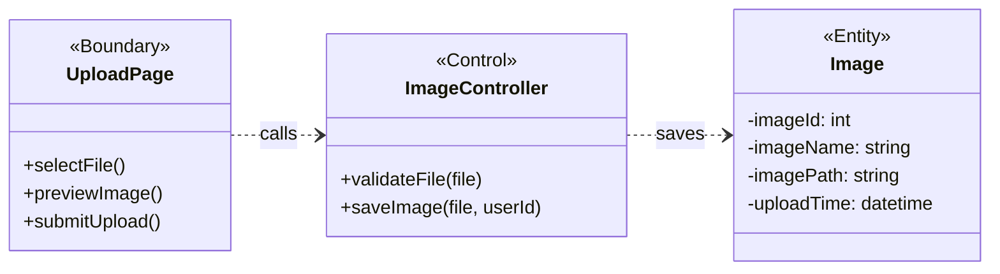

---

### A.2 As a farmer, I want the system to automatically count maize tassels, so that I do not need to perform manual counting.

**BCE Class Diagram**

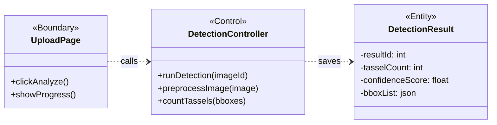

---

### A.3 As a farmer, I want to view counting results clearly, so that I can understand plant growth.

**BCE Class Diagram**

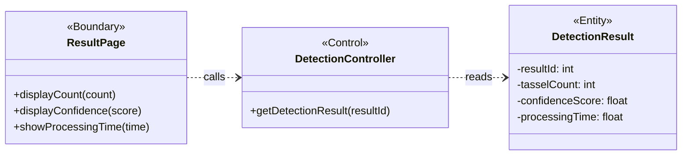

---

### A.4 As a farmer, I want to see highlighted tassels on images, so that I can visually verify the results.

**BCE Class Diagram**

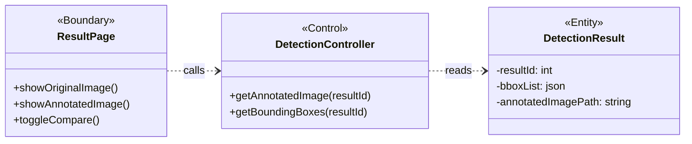

---

### A.5 As a farmer, I want to upload multiple images at once, so that I can save time.

**BCE Class Diagram**

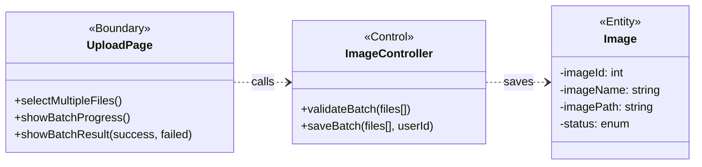

---

### A.6 As a farmer, I want to receive results within a short response time, so that I can make timely decisions.

**BCE Class Diagram**

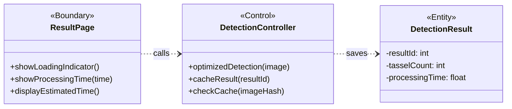

---

### A.7 As a farmer, I want to access the system via mobile devices, so that I can use it in the field.

**BCE Class Diagram**

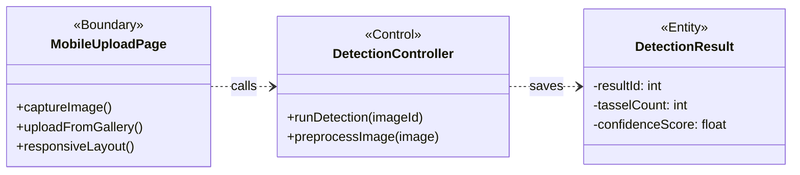

---

### A.8 As a farmer, I want an intuitive and user-friendly interface, so that I can use the system easily.

**BCE Class Diagram**

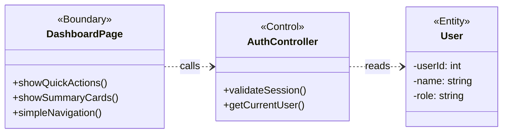

---

## B. Researcher (6 User Stories)

### B.1 As a researcher, I want accurate tassel counting results, so that I can conduct reliable analysis.

**BCE Class Diagram**

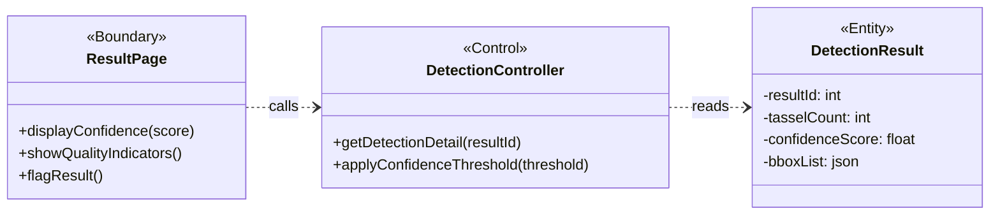

---

### B.2 As a researcher, I want to export results in standard formats, so that I can use them for further research.

**BCE Class Diagram**

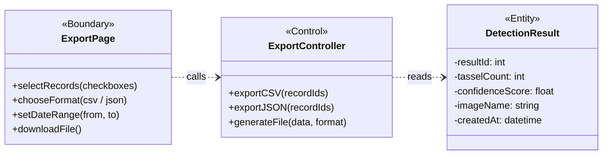

---

### B.3 As a researcher, I want to analyse historical data, so that I can study trends over time.

**BCE Class Diagram**

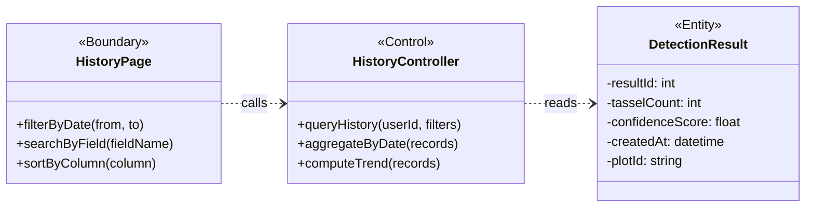

---

### B.4 As a researcher, I want to compare outputs from different models, so that I can evaluate performance.

**BCE Class Diagram**

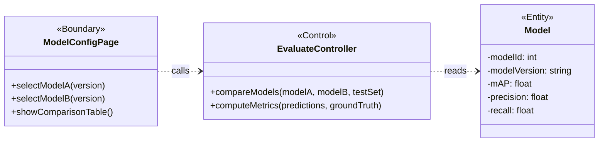

---

### B.5 As a researcher, I want access to raw datasets, so that I can preprocess and analyse data.

**BCE Class Diagram**

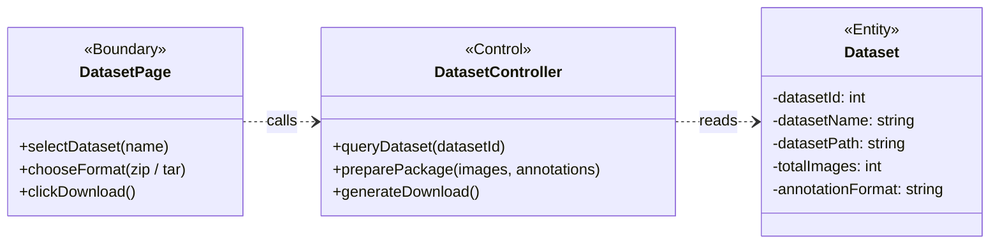

---

### B.6 As a researcher, I want to generate visual reports, so that I can present findings effectively.

**BCE Class Diagram**

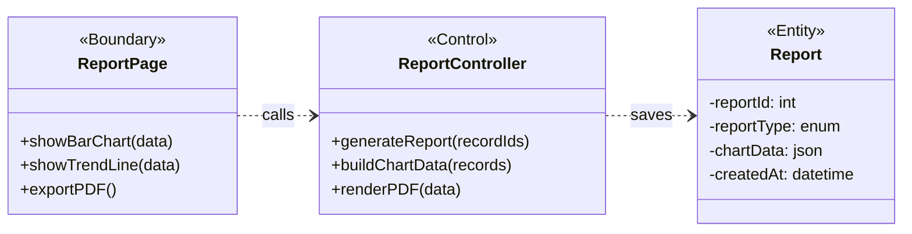

---

## C. Agronomist (5 User Stories)

### C.1 As an agronomist, I want to evaluate plant health based on tassel count, so that I can provide recommendations.

**BCE Class Diagram**

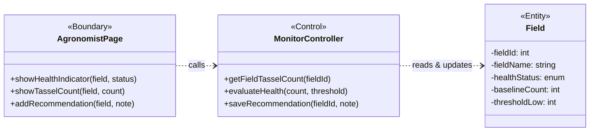

---

### C.2 As an agronomist, I want to monitor crop growth over time, so that I can track development stages.

**BCE Class Diagram**

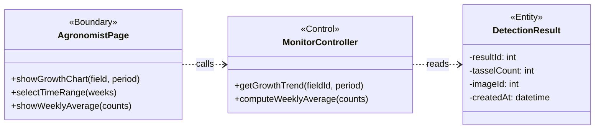

---

### C.3 As an agronomist, I want to detect abnormal patterns in tassel counts, so that I can identify potential issues early.

**BCE Class Diagram**

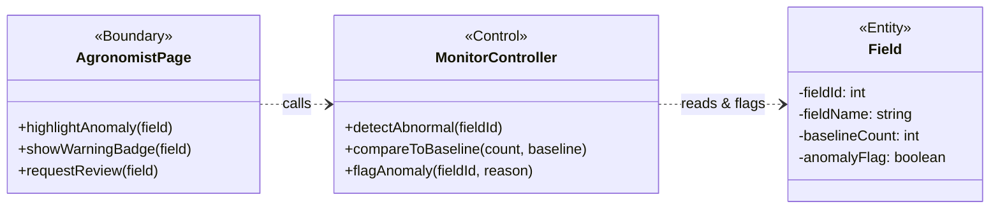

---

### C.4 As an agronomist, I want a dashboard view of multiple fields, so that I can analyse large-scale crop conditions.

**BCE Class Diagram**

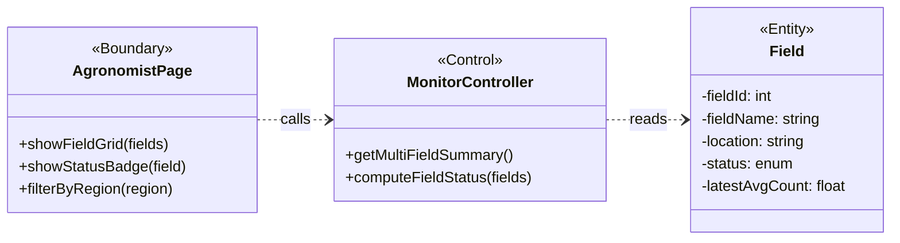

---

### C.5 As an agronomist, I want summarized insights, so that I can make decisions efficiently.

**BCE Class Diagram**

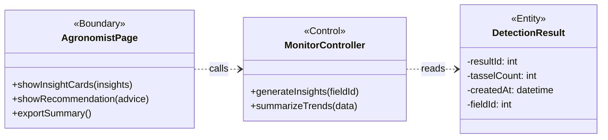

---

## D. Admin (6 User Stories)

### D.1 As an admin, I want to manage user accounts, so that I can control system access.

**BCE Class Diagram**

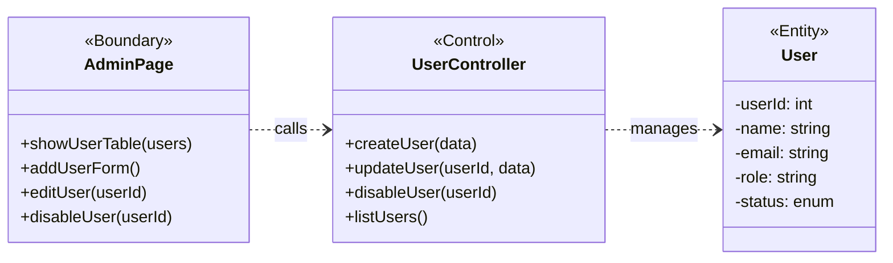

---

### D.2 As an admin, I want to store uploaded images securely, so that data is protected.

**BCE Class Diagram**

```mermaid
classDiagram
    direction LR
    class AdminPage {
        <<Boundary>>
        +showStorageStatus()
        +manageAccessControl()
        +viewImageStore()
    }
    class ImageController {
        <<Control>>
        +secureStore(image)
        +setAccessPolicy(imageId, role)
        +auditAccess(imageId)
    }
    class Image {
        <<Entity>>
        -imageId: int
        -imagePath: string
        -accessLevel: enum
        -uploadTime: datetime
    }
    AdminPage ..> ImageController : calls
    ImageController ..> Image : secures
```

---

### D.3 As an admin, I want to monitor system usage, so that I can ensure system performance.

**BCE Class Diagram**

```mermaid
classDiagram
    direction LR
    class AdminDashboardPage {
        <<Boundary>>
        +showActiveUsers()
        +showQueueLength()
        +showUptime()
        +showErrorRate()
    }
    class MonitorController {
        <<Control>>
        +getSystemMetrics()
        +getQueueStatus()
        +checkHealth()
    }
    class SystemLog {
        <<Entity>>
        -logId: int
        -action: string
        -details: text
        -createdAt: datetime
    }
    AdminDashboardPage ..> MonitorController : calls
    MonitorController ..> SystemLog : reads
```

---

### D.4 As an admin, I want to manage datasets, so that the system maintains high-quality training data.

**BCE Class Diagram**

```mermaid
classDiagram
    direction LR
    class AdminPage {
        <<Boundary>>
        +uploadDataset()
        +viewDatasetList()
        +editAnnotations()
        +deleteDataset(id)
    }
    class DatasetController {
        <<Control>>
        +uploadDataset(file)
        +listDatasets()
        +updateAnnotations(datasetId)
        +deleteDataset(datasetId)
    }
    class Dataset {
        <<Entity>>
        -datasetId: int
        -datasetName: string
        -datasetPath: string
        -annotationStatus: enum
        -totalImages: int
    }
    AdminPage ..> DatasetController : calls
    DatasetController ..> Dataset : manages
```

---

### D.5 As an admin, I want to control user permissions, so that different roles have appropriate access levels.

**BCE Class Diagram**

```mermaid
classDiagram
    direction LR
    class AdminPage {
        <<Boundary>>
        +editPermissions(userId)
        +changeRole(userId, role)
        +showUserList()
    }
    class UserController {
        <<Control>>
        +updateRole(userId, roleId)
        +updatePermissions(userId, perms)
        +getCurrentPermissions(userId)
    }
    class User {
        <<Entity>>
        -userId: int
        -name: string
        -role: string
        -permissions: json
        -status: enum
    }
    AdminPage ..> UserController : calls
    UserController ..> User : manages
```

---

### D.6 As an admin, I want to back up data regularly, so that data loss is prevented.

**BCE Class Diagram**

```mermaid
classDiagram
    direction LR
    class AdminPage {
        <<Boundary>>
        +startBackup()
        +viewBackupHistory()
        +restoreBackup(id)
    }
    class BackupController {
        <<Control>>
        +createBackup()
        +listBackups()
        +restoreBackup(backupId)
    }
    class SystemLog {
        <<Entity>>
        -logId: int
        -userId: int
        -action: string
        -createdAt: datetime
    }
    AdminPage ..> BackupController : calls
    BackupController ..> SystemLog : logs
```

---

## E. System (5 User Stories)

### E.1 As a system, I want to preprocess image data, so that the model can achieve better performance.

**BCE Class Diagram**

```mermaid
classDiagram
    direction LR
    class SystemInterface {
        <<Boundary>>
        +triggerPipeline()
        +monitorProgress()
    }
    class PreprocessController {
        <<Control>>
        +resizeImage(image, targetSize)
        +normalizePixels(image)
        +augmentImage(image, params)
    }
    class Image {
        <<Entity>>
        -imageId: int
        -imagePath: string
        -imageName: string
        -preprocessed: boolean
    }
    SystemInterface ..> PreprocessController : calls
    PreprocessController ..> Image : transforms
```

---

### E.2 As a system, I want to train deep learning models, so that tassel counting accuracy can be improved.

**BCE Class Diagram**

```mermaid
classDiagram
    direction LR
    class ModelConfigPage {
        <<Boundary>>
        +selectDataset()
        +setHyperparams()
        +startTraining()
        +showLossCurve()
    }
    class TrainController {
        <<Control>>
        +startTraining(datasetId, config)
        +runEpoch(model, data)
        +saveCheckpoint(runId)
    }
    class Model {
        <<Entity>>
        -modelId: int
        -modelVersion: string
        -weightsPath: string
        -status: enum
    }
    ModelConfigPage ..> TrainController : calls
    TrainController ..> Model : trains
```

---

### E.3 As a system, I want to evaluate model performance using appropriate metrics, so that accuracy can be measured and improved.

**BCE Class Diagram**

```mermaid
classDiagram
    direction LR
    class ModelConfigPage {
        <<Boundary>>
        +selectModel()
        +showMetrics()
        +showPRCurve()
    }
    class EvaluateController {
        <<Control>>
        +evaluateModel(modelId, testSet)
        +computeMAP(predictions, gt)
        +computePrecisionRecall(predictions, gt)
    }
    class Model {
        <<Entity>>
        -modelId: int
        -mAP: float
        -precision: float
        -recall: float
    }
    ModelConfigPage ..> EvaluateController : calls
    EvaluateController ..> Model : evaluates
```

---

### E.4 As a system, I want to deploy the trained model as a service, so that users can access it online.

**BCE Class Diagram**

```mermaid
classDiagram
    direction LR
    class ModelConfigPage {
        <<Boundary>>
        +selectVersion()
        +clickDeploy()
        +showDeployStatus()
    }
    class DeployController {
        <<Control>>
        +deployModel(modelId)
        +switchActiveModel(modelId)
        +rollbackModel()
        +healthCheck()
    }
    class Model {
        <<Entity>>
        -modelId: int
        -modelVersion: string
        -weightsPath: string
        -status: enum
        -deployedAt: datetime
    }
    ModelConfigPage ..> DeployController : calls
    DeployController ..> Model : activates
```

---

### E.5 As a system, I want to support system updates and model improvements, so that new features and enhancements can be integrated.

**BCE Class Diagram**

```mermaid
classDiagram
    direction LR
    class ModelConfigPage {
        <<Boundary>>
        +uploadNewVersion()
        +compareVersions()
        +scheduleUpdate()
    }
    class DeployController {
        <<Control>>
        +registerVersion(modelId)
        +stageUpdate(modelId)
        +applyUpdate(modelId)
        +listVersions()
    }
    class Model {
        <<Entity>>
        -modelId: int
        -modelVersion: string
        -weightsPath: string
        -parentVersion: string
        -changelog: text
    }
    ModelConfigPage ..> DeployController : calls
    DeployController ..> Model : versions
```

## F. Sequence Diagrams — Farmer (8 diagrams)

### F.1 As a farmer, I want to upload maize images, so that I can analyse crop conditions.

```mermaid
sequenceDiagram
    actor Farmer
    participant UpPage as <<B>>UploadPage
    participant ImgCtrl as <<C>>ImageController
    participant Image as <<E>>Image

    Farmer->>UpPage: selectFile(maize.jpg)
    activate UpPage
    UpPage->>UpPage: previewImage()
    Farmer->>UpPage: click Upload
    UpPage->>ImgCtrl: uploadImage(file, userId)
    activate ImgCtrl
    ImgCtrl->>ImgCtrl: validateFile(file)
    ImgCtrl->>Image: save(imageName, path)
    activate Image
    Image-->>ImgCtrl: imageId
    deactivate Image
    ImgCtrl-->>UpPage: upload success
    deactivate ImgCtrl
    UpPage-->>Farmer: show success message
    deactivate UpPage
```

### F.2 As a farmer, I want the system to automatically count maize tassels, so that I do not need to perform manual counting.

```mermaid
sequenceDiagram
    actor Farmer
    participant UpPage as <<B>>UploadPage
    participant DetCtrl as <<C>>DetectionController
    participant YOLO as YOLO Model
    participant Result as <<E>>DetectionResult

    Farmer->>UpPage: click Analyze
    activate UpPage
    UpPage->>UpPage: show progress indicator
    UpPage->>DetCtrl: runDetection(imageId)
    activate DetCtrl
    DetCtrl->>DetCtrl: preprocess(image)
    DetCtrl->>YOLO: detect(image)
    activate YOLO
    YOLO-->>DetCtrl: bboxes[]
    deactivate YOLO
    DetCtrl->>DetCtrl: countTassels(bboxes)
    DetCtrl->>Result: save(count, confidence)
    activate Result
    Result-->>DetCtrl: resultId
    deactivate Result
    DetCtrl-->>UpPage: {resultId, count: 37}
    deactivate DetCtrl
    UpPage-->>Farmer: redirect to result page
    deactivate UpPage
```

### F.3 As a farmer, I want to view counting results clearly, so that I can understand plant growth.

```mermaid
sequenceDiagram
    actor Farmer
    participant ResPage as <<B>>ResultPage
    participant DetCtrl as <<C>>DetectionController
    participant Result as <<E>>DetectionResult

    Farmer->>ResPage: open result page (resultId)
    activate ResPage
    ResPage->>DetCtrl: getDetectionResult(resultId)
    activate DetCtrl
    DetCtrl->>Result: query(resultId)
    activate Result
    Result-->>DetCtrl: {count: 37, confidence: 0.89, time: 2.4s}
    deactivate Result
    DetCtrl-->>ResPage: result data
    deactivate DetCtrl
    ResPage-->>Farmer: display count + confidence + processing time
    deactivate ResPage
```

### F.4 As a farmer, I want to see highlighted tassels on images, so that I can visually verify the results.

```mermaid
sequenceDiagram
    actor Farmer
    participant ResPage as <<B>>ResultPage
    participant DetCtrl as <<C>>DetectionController
    participant Result as <<E>>DetectionResult

    Farmer->>ResPage: open result page
    activate ResPage
    ResPage->>DetCtrl: getAnnotatedImage(resultId)
    activate DetCtrl
    DetCtrl->>Result: query(resultId)
    activate Result
    Result-->>DetCtrl: {annotatedImagePath, bboxList}
    deactivate Result
    DetCtrl-->>ResPage: annotated image + bbox data
    deactivate DetCtrl
    ResPage-->>Farmer: display original + annotated images side by side
    deactivate ResPage
```

### F.5 As a farmer, I want to upload multiple images at once, so that I can save time.

```mermaid
sequenceDiagram
    actor Farmer
    participant UpPage as <<B>>UploadPage
    participant ImgCtrl as <<C>>ImageController
    participant Image as <<E>>Image

    Farmer->>UpPage: selectFiles([img1, img2, img3])
    activate UpPage
    UpPage->>UpPage: show file list
    Farmer->>UpPage: click Upload All
    UpPage->>ImgCtrl: uploadBatch(files[], userId)
    activate ImgCtrl
    ImgCtrl->>ImgCtrl: validateBatch(files)
    loop each valid file
        ImgCtrl->>Image: save(file)
        activate Image
        Image-->>ImgCtrl: imageId
        deactivate Image
    end
    ImgCtrl-->>UpPage: {success: 2, failed: 1}
    deactivate ImgCtrl
    UpPage-->>Farmer: show batch result summary
    deactivate UpPage
```

### F.6 As a farmer, I want to receive results within a short response time, so that I can make timely decisions.

```mermaid
sequenceDiagram
    actor Farmer
    participant ResPage as <<B>>ResultPage
    participant DetCtrl as <<C>>DetectionController
    participant Result as <<E>>DetectionResult

    Farmer->>ResPage: click Analyze
    activate ResPage
    ResPage->>ResPage: show loading indicator
    ResPage->>DetCtrl: runDetection(imageId)
    activate DetCtrl
    DetCtrl->>DetCtrl: checkCache(imageHash)
    alt cache miss
        DetCtrl->>DetCtrl: optimizedDetection(image)
    end
    DetCtrl->>Result: save(count, confidence)
    activate Result
    Result-->>DetCtrl: resultId
    deactivate Result
    DetCtrl-->>ResPage: {count, processingTime: 1.8s}
    deactivate DetCtrl
    ResPage-->>Farmer: show result + processing time
    deactivate ResPage
```

### F.7 As a farmer, I want to access the system via mobile devices, so that I can use it in the field.

```mermaid
sequenceDiagram
    actor Farmer
    participant MobPage as <<B>>MobileUploadPage
    participant DetCtrl as <<C>>DetectionController
    participant Result as <<E>>DetectionResult

    Farmer->>MobPage: open app on mobile
    activate MobPage
    MobPage->>MobPage: render responsive layout
    Farmer->>MobPage: capture photo in field
    MobPage->>MobPage: preview captured image
    Farmer->>MobPage: tap Analyze
    MobPage->>DetCtrl: runDetection(imageId)
    activate DetCtrl
    DetCtrl->>DetCtrl: preprocess(image)
    DetCtrl->>Result: save(count, confidence)
    activate Result
    Result-->>DetCtrl: resultId
    deactivate Result
    DetCtrl-->>MobPage: {count, confidence}
    deactivate DetCtrl
    MobPage-->>Farmer: show count in large readable font
    deactivate MobPage
```

### F.8 As a farmer, I want an intuitive and user-friendly interface, so that I can use the system easily.

```mermaid
sequenceDiagram
    actor Farmer
    participant DashPage as <<B>>DashboardPage
    participant AuthCtrl as <<C>>AuthController
    participant User as <<E>>User

    Farmer->>DashPage: enter system
    activate DashPage
    DashPage->>AuthCtrl: validateSession()
    activate AuthCtrl
    AuthCtrl->>User: getCurrentUser()
    activate User
    User-->>AuthCtrl: {name, role}
    deactivate User
    AuthCtrl-->>DashPage: session valid
    deactivate AuthCtrl
    DashPage->>DashPage: show welcome + quick-action buttons
    DashPage-->>Farmer: display simple navigation
    deactivate DashPage
```

---

## G. Sequence Diagrams — Researcher (6 diagrams)

### G.1 As a researcher, I want accurate tassel counting results, so that I can conduct reliable analysis.

```mermaid
sequenceDiagram
    actor Researcher
    participant ResPage as <<B>>ResultPage
    participant DetCtrl as <<C>>DetectionController
    participant Result as <<E>>DetectionResult

    Researcher->>ResPage: open result (resultId)
    activate ResPage
    ResPage->>DetCtrl: getDetectionDetail(resultId)
    activate DetCtrl
    DetCtrl->>Result: query(resultId)
    activate Result
    Result-->>DetCtrl: {count, confidence, bboxList}
    deactivate Result
    DetCtrl->>DetCtrl: applyConfidenceThreshold(0.7)
    DetCtrl-->>ResPage: {count: 37, confidence: 0.89, lowConf: 3}
    deactivate DetCtrl
    ResPage-->>Researcher: display count + quality indicators
    deactivate ResPage
```

### G.2 As a researcher, I want to export results in standard formats, so that I can use them for further research.

```mermaid
sequenceDiagram
    actor Researcher
    participant ExpPage as <<B>>ExportPage
    participant ExpCtrl as <<C>>ExportController
    participant Result as <<E>>DetectionResult

    Researcher->>ExpPage: open export page
    activate ExpPage
    Researcher->>ExpPage: set date range + choose CSV format
    Researcher->>ExpPage: select 24 records + click Export
    ExpPage->>ExpCtrl: exportCSV(recordIds)
    activate ExpCtrl
    ExpCtrl->>Result: query by record IDs
    activate Result
    Result-->>ExpCtrl: records[]
    deactivate Result
    ExpCtrl->>ExpCtrl: generateCSV(records)
    ExpCtrl-->>ExpPage: csvFileBlob
    deactivate ExpCtrl
    ExpPage-->>Researcher: download CSV file
    deactivate ExpPage
```

### G.3 As a researcher, I want to analyse historical data, so that I can study trends over time.

```mermaid
sequenceDiagram
    actor Researcher
    participant HistPage as <<B>>HistoryPage
    participant HistCtrl as <<C>>HistoryController
    participant Result as <<E>>DetectionResult

    Researcher->>HistPage: open history page
    activate HistPage
    HistPage->>HistCtrl: getHistory(userId)
    activate HistCtrl
    HistCtrl->>Result: query(userId, ORDER BY date DESC)
    activate Result
    Result-->>HistCtrl: records[]
    deactivate Result
    HistCtrl-->>HistPage: history data
    deactivate HistCtrl
    HistPage-->>Researcher: display table with sort and filter
    deactivate HistPage
    Researcher->>HistPage: filter by field + sort by count
    activate HistPage
    HistPage->>HistCtrl: filterHistory(field, sort)
    activate HistCtrl
    HistCtrl->>Result: query with filters
    activate Result
    Result-->>HistCtrl: filtered records
    deactivate Result
    HistCtrl->>HistCtrl: computeTrend(records)
    HistCtrl-->>HistPage: {records, trend: increasing}
    deactivate HistCtrl
    HistPage-->>Researcher: updated table + trend indicator
    deactivate HistPage
```

### G.4 As a researcher, I want to compare outputs from different models, so that I can evaluate performance.

```mermaid
sequenceDiagram
    actor Researcher
    participant ConfigPage as <<B>>ModelConfigPage
    participant EvalCtrl as <<C>>EvaluateController
    participant Model as <<E>>Model

    Researcher->>ConfigPage: select Model A + Model B
    activate ConfigPage
    Researcher->>ConfigPage: click Compare
    ConfigPage->>EvalCtrl: compareModels(modelA, modelB, testSet)
    activate EvalCtrl
    EvalCtrl->>Model: runInference(modelA, testSet)
    activate Model
    Model-->>EvalCtrl: predictionsA
    deactivate Model
    EvalCtrl->>EvalCtrl: computeMetrics(predictionsA)
    EvalCtrl->>Model: runInference(modelB, testSet)
    activate Model
    Model-->>EvalCtrl: predictionsB
    deactivate Model
    EvalCtrl->>EvalCtrl: computeMetrics(predictionsB)
    EvalCtrl-->>ConfigPage: {A: mAP 0.78, B: mAP 0.62}
    deactivate EvalCtrl
    ConfigPage-->>Researcher: side-by-side comparison table
    deactivate ConfigPage
```

### G.5 As a researcher, I want access to raw datasets, so that I can preprocess and analyse data.

```mermaid
sequenceDiagram
    actor Researcher
    participant DsPage as <<B>>DatasetPage
    participant DsCtrl as <<C>>DatasetController
    participant Dataset as <<E>>Dataset

    Researcher->>DsPage: open dataset access
    activate DsPage
    Researcher->>DsPage: select dataset + choose ZIP format
    Researcher->>DsPage: click Download
    DsPage->>DsCtrl: downloadDataset(datasetId, format)
    activate DsCtrl
    DsCtrl->>Dataset: query(datasetId)
    activate Dataset
    Dataset-->>DsCtrl: {name, totalImages, annotationFormat}
    deactivate Dataset
    DsCtrl->>DsCtrl: preparePackage(images + annotations)
    DsCtrl-->>DsPage: zipFile
    deactivate DsCtrl
    DsPage-->>Researcher: download dataset ZIP file
    deactivate DsPage
```

### G.6 As a researcher, I want to generate visual reports, so that I can present findings effectively.

```mermaid
sequenceDiagram
    actor Researcher
    participant RepPage as <<B>>ReportPage
    participant RepCtrl as <<C>>ReportController
    participant Report as <<E>>Report

    Researcher->>RepPage: select date range + fields
    activate RepPage
    Researcher->>RepPage: click Generate Report
    RepPage->>RepCtrl: generateReport(fieldIds, dateRange)
    activate RepCtrl
    RepCtrl->>RepCtrl: query detection results + aggregate by week
    RepCtrl->>RepCtrl: buildChartData(data)
    RepCtrl->>Report: save(chartJSON, summary)
    activate Report
    Report-->>RepCtrl: reportId
    deactivate Report
    RepCtrl-->>RepPage: {reportId, chartData, summary}
    deactivate RepCtrl
    RepPage-->>Researcher: bar chart + trend line + summary text
    deactivate RepPage
    Researcher->>RepPage: click Export PDF
    activate RepPage
    RepPage-->>Researcher: download PDF report
    deactivate RepPage
```

---

## H. Sequence Diagrams — Agronomist (5 diagrams)

### H.1 As an agronomist, I want to evaluate plant health based on tassel count, so that I can provide recommendations.

```mermaid
sequenceDiagram
    actor Agronomist
    participant AgroPage as <<B>>AgronomistPage
    participant MonCtrl as <<C>>MonitorController
    participant Field as <<E>>Field

    Agronomist->>AgroPage: select Field B
    activate AgroPage
    AgroPage->>MonCtrl: evaluateHealth(fieldB)
    activate MonCtrl
    MonCtrl->>Field: query(fieldB)
    activate Field
    Field-->>MonCtrl: {baseline: 30, thresholdLow: 20, latestCount: 18}
    deactivate Field
    MonCtrl->>MonCtrl: compare(count, baseline, threshold)
    MonCtrl-->>AgroPage: {health: Warning, count: 18, gap: -12}
    deactivate MonCtrl
    AgroPage-->>Agronomist: show warning + recommendation note
    deactivate AgroPage
```

### H.2 As an agronomist, I want to monitor crop growth over time, so that I can track development stages.

```mermaid
sequenceDiagram
    actor Agronomist
    participant AgroPage as <<B>>AgronomistPage
    participant MonCtrl as <<C>>MonitorController
    participant Result as <<E>>DetectionResult

    Agronomist->>AgroPage: select Field A + period 4 weeks
    activate AgroPage
    AgroPage->>MonCtrl: getGrowthTrend(fieldA, period=4weeks)
    activate MonCtrl
    MonCtrl->>Result: query(fieldA, group by week, last 4 weeks)
    activate Result
    Result-->>MonCtrl: [{wk1:20, wk2:25, wk3:31, wk4:35}]
    deactivate Result
    MonCtrl->>MonCtrl: computeGrowthRate(data)
    MonCtrl-->>AgroPage: {trend: [20,25,31,35], rate: +15/week}
    deactivate MonCtrl
    AgroPage-->>Agronomist: display growth line chart
    deactivate AgroPage
```

### H.3 As an agronomist, I want to detect abnormal patterns in tassel counts, so that I can identify potential issues early.

```mermaid
sequenceDiagram
    actor Agronomist
    participant AgroPage as <<B>>AgronomistPage
    participant MonCtrl as <<C>>MonitorController
    participant Field as <<E>>Field

    Agronomist->>AgroPage: open alerts page
    activate AgroPage
    AgroPage->>MonCtrl: scanAllFields()
    activate MonCtrl
    loop each field
        MonCtrl->>Field: getDailyCounts(field)
        activate Field
        Field-->>MonCtrl: counts[]
        deactivate Field
        MonCtrl->>MonCtrl: compareToBaseline(counts, baseline)
        alt count below threshold
            MonCtrl->>Field: setAnomalyFlag(field, true)
            activate Field
            Field-->>MonCtrl: flagged
            deactivate Field
        end
    end
    MonCtrl-->>AgroPage: anomalies: [Field B: low count]
    deactivate MonCtrl
    AgroPage-->>Agronomist: highlight Field B with warning badge
    deactivate AgroPage
```

### H.4 As an agronomist, I want a dashboard view of multiple fields, so that I can analyse large-scale crop conditions.

```mermaid
sequenceDiagram
    actor Agronomist
    participant AgroPage as <<B>>AgronomistPage
    participant MonCtrl as <<C>>MonitorController
    participant Field as <<E>>Field

    Agronomist->>AgroPage: open dashboard
    activate AgroPage
    AgroPage->>MonCtrl: getMultiFieldSummary()
    activate MonCtrl
    MonCtrl->>Field: query all fields (region = North)
    activate Field
    Field-->>MonCtrl: fields[]
    deactivate Field
    loop each field
        MonCtrl->>MonCtrl: computeFieldStatus(field)
    end
    MonCtrl-->>AgroPage: 3 fields: A(35 Healthy) B(18 Warning) C(42 Healthy)
    deactivate MonCtrl
    AgroPage-->>Agronomist: grid of field cards with status badges
    deactivate AgroPage
```

### H.5 As an agronomist, I want summarized insights, so that I can make decisions efficiently.

```mermaid
sequenceDiagram
    actor Agronomist
    participant AgroPage as <<B>>AgronomistPage
    participant MonCtrl as <<C>>MonitorController
    participant Result as <<E>>DetectionResult

    Agronomist->>AgroPage: click Generate Insights
    activate AgroPage
    AgroPage->>MonCtrl: generateInsights(allFields)
    activate MonCtrl
    MonCtrl->>Result: query(all fields, last 30 days)
    activate Result
    Result-->>MonCtrl: aggregated data
    deactivate Result
    MonCtrl->>MonCtrl: analyze trends + summarize
    MonCtrl-->>AgroPage: {insights: [...], recommendation: "..."}
    deactivate MonCtrl
    AgroPage-->>Agronomist: insight cards + recommendation text
    deactivate AgroPage
```

---

## I. Sequence Diagrams — Admin (6 diagrams)

### I.1 As an admin, I want to manage user accounts, so that I can control system access.

```mermaid
sequenceDiagram
    actor Admin
    participant AdminPage as <<B>>AdminPage
    participant UserCtrl as <<C>>UserController
    participant User as <<E>>User

    Admin->>AdminPage: open user management
    activate AdminPage
    AdminPage->>UserCtrl: listUsers()
    activate UserCtrl
    UserCtrl->>User: query all
    activate User
    User-->>UserCtrl: users[]
    deactivate User
    UserCtrl-->>AdminPage: user table data
    deactivate UserCtrl
    AdminPage-->>Admin: display user table
    deactivate AdminPage
    Admin->>AdminPage: click Add User + fill form
    activate AdminPage
    AdminPage->>UserCtrl: createUser(name, email, role)
    activate UserCtrl
    UserCtrl->>UserCtrl: validate email + hash password
    UserCtrl->>User: insert(user data)
    activate User
    User-->>UserCtrl: userId
    deactivate User
    UserCtrl-->>AdminPage: user created
    deactivate UserCtrl
    AdminPage-->>Admin: show success + refresh table
    deactivate AdminPage
```

### I.2 As an admin, I want to store uploaded images securely, so that data is protected.

```mermaid
sequenceDiagram
    actor Admin
    participant AdminPage as <<B>>AdminPage
    participant ImgCtrl as <<C>>ImageController
    participant Image as <<E>>Image

    Admin->>AdminPage: open storage management
    activate AdminPage
    AdminPage->>ImgCtrl: getStorageStatus()
    activate ImgCtrl
    ImgCtrl->>Image: count all + total size
    activate Image
    Image-->>ImgCtrl: {total: 520, sizeMB: 1240}
    deactivate Image
    ImgCtrl-->>AdminPage: storage summary
    deactivate ImgCtrl
    AdminPage-->>Admin: display storage status
    deactivate AdminPage
    Admin->>AdminPage: set access policy (Farmer = own images only)
    activate AdminPage
    AdminPage->>ImgCtrl: setAccessPolicy(Farmer, accessLevel=OWN)
    activate ImgCtrl
    ImgCtrl->>Image: apply policy to Farmer images
    activate Image
    Image-->>ImgCtrl: policy applied
    deactivate Image
    ImgCtrl-->>AdminPage: policy updated
    deactivate ImgCtrl
    AdminPage-->>Admin: access policy saved
    deactivate AdminPage
```

### I.3 As an admin, I want to monitor system usage, so that I can ensure system performance.

```mermaid
sequenceDiagram
    actor Admin
    participant DashPage as <<B>>AdminDashboardPage
    participant MonCtrl as <<C>>MonitorController
    participant Log as <<E>>SystemLog

    Admin->>DashPage: open admin dashboard
    activate DashPage
    DashPage->>MonCtrl: getSystemMetrics()
    activate MonCtrl
    MonCtrl->>Log: query(last 24h)
    activate Log
    Log-->>MonCtrl: {apiCalls: 1420, errors: 23, avgTime: 1.8s, activeUsers: 6}
    deactivate Log
    MonCtrl-->>DashPage: system metrics
    deactivate MonCtrl
    DashPage-->>Admin: display active users, queue, error rate, uptime
    deactivate DashPage
```

### I.4 As an admin, I want to manage datasets, so that the system maintains high-quality training data.

```mermaid
sequenceDiagram
    actor Admin
    participant AdminPage as <<B>>AdminPage
    participant DsCtrl as <<C>>DatasetController
    participant Dataset as <<E>>Dataset

    Admin->>AdminPage: open dataset management
    activate AdminPage
    AdminPage->>DsCtrl: listDatasets()
    activate DsCtrl
    DsCtrl->>Dataset: query all
    activate Dataset
    Dataset-->>DsCtrl: [{v1: 200 img}, {v2: 500 img}]
    deactivate Dataset
    DsCtrl-->>AdminPage: dataset list
    deactivate DsCtrl
    AdminPage-->>Admin: display datasets
    deactivate AdminPage
    Admin->>AdminPage: click Upload New Dataset
    activate AdminPage
    AdminPage->>DsCtrl: uploadDataset(file, name)
    activate DsCtrl
    DsCtrl->>DsCtrl: validate format
    DsCtrl->>Dataset: insert(name, path, annotationStatus)
    activate Dataset
    Dataset-->>DsCtrl: datasetId
    deactivate Dataset
    DsCtrl-->>AdminPage: upload success
    deactivate DsCtrl
    AdminPage-->>Admin: new dataset added
    deactivate AdminPage
```

### I.5 As an admin, I want to control user permissions, so that different roles have appropriate access levels.

```mermaid
sequenceDiagram
    actor Admin
    participant AdminPage as <<B>>AdminPage
    participant UserCtrl as <<C>>UserController
    participant User as <<E>>User

    Admin->>AdminPage: open user management
    activate AdminPage
    Admin->>AdminPage: click user + edit permissions
    AdminPage->>UserCtrl: getCurrentPermissions(userId)
    activate UserCtrl
    UserCtrl->>User: query(userId)
    activate User
    User-->>UserCtrl: {name, role, permissions}
    deactivate User
    UserCtrl-->>AdminPage: current permissions
    deactivate UserCtrl
    AdminPage-->>Admin: display role + permission settings
    deactivate AdminPage
    Admin->>AdminPage: change role + save
    activate AdminPage
    AdminPage->>UserCtrl: updateRole(userId, newRole)
    activate UserCtrl
    UserCtrl->>UserCtrl: validate (cannot remove own admin role)
    UserCtrl->>User: update(userId, role, permissions)
    activate User
    User-->>UserCtrl: updated
    deactivate User
    UserCtrl-->>AdminPage: role updated
    deactivate UserCtrl
    AdminPage-->>Admin: user permissions saved
    deactivate AdminPage
```

### I.6 As an admin, I want to back up data regularly, so that data loss is prevented.

```mermaid
sequenceDiagram
    actor Admin
    participant AdminPage as <<B>>AdminPage
    participant BkCtrl as <<C>>BackupController
    participant Log as <<E>>SystemLog

    Admin->>AdminPage: open backup management
    activate AdminPage
    AdminPage->>BkCtrl: listBackups()
    activate BkCtrl
    BkCtrl->>Log: query backup history
    activate Log
    Log-->>BkCtrl: backup records
    deactivate Log
    BkCtrl-->>AdminPage: backup history
    deactivate BkCtrl
    AdminPage-->>Admin: display backup list
    deactivate AdminPage
    Admin->>AdminPage: click Create Backup
    activate AdminPage
    AdminPage->>BkCtrl: createBackup()
    activate BkCtrl
    BkCtrl->>BkCtrl: export users + images + results
    BkCtrl->>BkCtrl: compress to backup.zip
    BkCtrl->>Log: log backup created
    activate Log
    Log-->>BkCtrl: logged
    deactivate Log
    BkCtrl-->>AdminPage: {backupId, size: 520MB}
    deactivate BkCtrl
    AdminPage-->>Admin: backup completed
    deactivate AdminPage
```

---

## J. Sequence Diagrams — System (5 diagrams)

### J.1 As a system, I want to preprocess image data, so that the model can achieve better performance.

```mermaid
sequenceDiagram
    participant Sys as System
    participant SysIF as <<B>>SystemInterface
    participant PreCtrl as <<C>>PreprocessController
    participant Image as <<E>>Image

    Sys->>SysIF: trigger preprocessing pipeline
    activate SysIF
    SysIF->>PreCtrl: startPreprocessing()
    activate PreCtrl
    loop each unprocessed image
        PreCtrl->>Image: load raw image
        activate Image
        Image-->>PreCtrl: rawImage
        deactivate Image
        PreCtrl->>PreCtrl: resize(640x640)
        PreCtrl->>PreCtrl: normalize + augment
        PreCtrl->>Image: savePreprocessed(tensor)
        activate Image
        Image-->>PreCtrl: saved
        deactivate Image
    end
    PreCtrl-->>SysIF: preprocessing complete (n images)
    deactivate PreCtrl
    SysIF-->>Sys: pipeline finished
    deactivate SysIF
```

### J.2 As a system, I want to train deep learning models, so that tassel counting accuracy can be improved.

```mermaid
sequenceDiagram
    participant Sys as System
    participant ConfigPage as <<B>>ModelConfigPage
    participant TrainCtrl as <<C>>TrainController
    participant Model as <<E>>Model

    Sys->>ConfigPage: start training (datasetId, hyperparams)
    activate ConfigPage
    ConfigPage->>TrainCtrl: startTraining(config)
    activate TrainCtrl
    TrainCtrl->>TrainCtrl: load training + validation sets
    TrainCtrl->>Model: initialize(YOLOv8, pretrained=true)
    activate Model
    Model-->>TrainCtrl: model ready
    deactivate Model
    loop epoch 1..100
        TrainCtrl->>Model: trainOneEpoch(trainLoader)
        activate Model
        Model-->>TrainCtrl: trainLoss
        deactivate Model
        TrainCtrl->>Model: validate(valLoader)
        activate Model
        Model-->>TrainCtrl: valLoss, mAP
        deactivate Model
        TrainCtrl->>TrainCtrl: checkEarlyStop(valLoss)
    end
    TrainCtrl->>Model: saveWeights(best checkpoint)
    activate Model
    Model-->>TrainCtrl: saved
    deactivate Model
    TrainCtrl-->>ConfigPage: training complete (best mAP: 0.78)
    deactivate TrainCtrl
    ConfigPage-->>Sys: model trained
    deactivate ConfigPage
```

### J.3 As a system, I want to evaluate model performance using appropriate metrics, so that accuracy can be measured and improved.

```mermaid
sequenceDiagram
    participant Sys as System
    participant ConfigPage as <<B>>ModelConfigPage
    participant EvalCtrl as <<C>>EvaluateController
    participant Model as <<E>>Model

    Sys->>ConfigPage: evaluate model
    activate ConfigPage
    ConfigPage->>EvalCtrl: evaluateModel(modelId)
    activate EvalCtrl
    EvalCtrl->>Model: load weights
    activate Model
    Model-->>EvalCtrl: model loaded
    deactivate Model
    EvalCtrl->>EvalCtrl: load test set
    EvalCtrl->>Model: runInference(testImages)
    activate Model
    Model-->>EvalCtrl: predictions[]
    deactivate Model
    EvalCtrl->>EvalCtrl: computeIoU(pred, gt)
    EvalCtrl->>EvalCtrl: computePrecision + Recall
    EvalCtrl->>EvalCtrl: compute mAP
    EvalCtrl->>Model: updateMetrics(mAP, precision, recall)
    activate Model
    Model-->>EvalCtrl: metrics saved
    deactivate Model
    EvalCtrl-->>ConfigPage: {mAP: 0.78, precision: 0.82, recall: 0.75}
    deactivate EvalCtrl
    ConfigPage-->>Sys: evaluation complete
    deactivate ConfigPage
```

### J.4 As a system, I want to deploy the trained model as a service, so that users can access it online.

```mermaid
sequenceDiagram
    participant Sys as System
    participant ConfigPage as <<B>>ModelConfigPage
    participant DeployCtrl as <<C>>DeployController
    participant Model as <<E>>Model

    Sys->>ConfigPage: deploy model (v1.1)
    activate ConfigPage
    ConfigPage->>DeployCtrl: deployModel(modelId)
    activate DeployCtrl
    DeployCtrl->>Model: getModel(modelId)
    activate Model
    Model-->>DeployCtrl: {version: v1.1, weightsPath, status: trained}
    deactivate Model
    DeployCtrl->>DeployCtrl: loadWeights + warmUp
    DeployCtrl->>DeployCtrl: healthCheck()
    DeployCtrl->>Model: setActive(v1.1)
    activate Model
    Model-->>DeployCtrl: activated
    deactivate Model
    DeployCtrl->>Model: archive(v1.0)
    activate Model
    Model-->>DeployCtrl: archived
    deactivate Model
    DeployCtrl-->>ConfigPage: model v1.1 deployed
    deactivate DeployCtrl
    ConfigPage-->>Sys: deployment successful
    deactivate ConfigPage
```

### J.5 As a system, I want to support system updates and model improvements, so that new features and enhancements can be integrated.

```mermaid
sequenceDiagram
    participant Sys as System
    participant ConfigPage as <<B>>ModelConfigPage
    participant DeployCtrl as <<C>>DeployController
    participant Model as <<E>>Model

    Sys->>ConfigPage: register new version (v1.2)
    activate ConfigPage
    ConfigPage->>DeployCtrl: registerVersion(weightsPath, changelog)
    activate DeployCtrl
    DeployCtrl->>Model: insert(v1.2, parent: v1.1)
    activate Model
    Model-->>DeployCtrl: modelId
    deactivate Model
    DeployCtrl-->>ConfigPage: v1.2 registered
    deactivate DeployCtrl
    ConfigPage-->>Sys: version registered
    deactivate ConfigPage
    Sys->>ConfigPage: apply update
    activate ConfigPage
    ConfigPage->>DeployCtrl: applyUpdate(modelId)
    activate DeployCtrl
    DeployCtrl->>DeployCtrl: load model in staging
    DeployCtrl->>DeployCtrl: run smoke tests
    DeployCtrl->>Model: setActive(v1.2)
    activate Model
    Model-->>DeployCtrl: activated
    deactivate Model
    DeployCtrl->>Model: archive(v1.1)
    activate Model
    Model-->>DeployCtrl: archived
    deactivate Model
    DeployCtrl-->>ConfigPage: v1.2 now active
    deactivate DeployCtrl
    ConfigPage-->>Sys: update complete
    deactivate ConfigPage
```

---

## K. User Story → Diagram Index

| # | User Story | BCE | Seq |
|---|-----------|-----|-----|
| F1 | Upload maize images | A.1 | F.1 |
| F2 | Auto count tassels | A.2 | F.2 |
| F3 | View counting results | A.3 | F.3 |
| F4 | See highlighted tassels | A.4 | F.4 |
| F5 | Upload multiple images | A.5 | F.5 |
| F6 | Quick response time | A.6 | F.6 |
| F7 | Mobile device access | A.7 | F.7 |
| F8 | Intuitive interface | A.8 | F.8 |
| R1 | Accurate results | B.1 | G.1 |
| R2 | Export CSV/JSON | B.2 | G.2 |
| R3 | Analyse historical data | B.3 | G.3 |
| R4 | Compare model outputs | B.4 | G.4 |
| R5 | Access raw datasets | B.5 | G.5 |
| R6 | Generate visual reports | B.6 | G.6 |
| A1 | Evaluate plant health | C.1 | H.1 |
| A2 | Monitor crop growth | C.2 | H.2 |
| A3 | Detect abnormal patterns | C.3 | H.3 |
| A4 | Multi-field dashboard | C.4 | H.4 |
| A5 | Summarized insights | C.5 | H.5 |
| D1 | Manage user accounts | D.1 | I.1 |
| D2 | Store images securely | D.2 | I.2 |
| D3 | Monitor system usage | D.3 | I.3 |
| D4 | Manage datasets | D.4 | I.4 |
| D5 | Control user permissions | D.5 | I.5 |
| D6 | Back up data regularly | D.6 | I.6 |
| S1 | Preprocess image data | E.1 | J.1 |
| S2 | Train deep learning models | E.2 | J.2 |
| S3 | Evaluate model performance | E.3 | J.3 |
| S4 | Deploy model as service | E.4 | J.4 |
| S5 | System updates | E.5 | J.5 |
